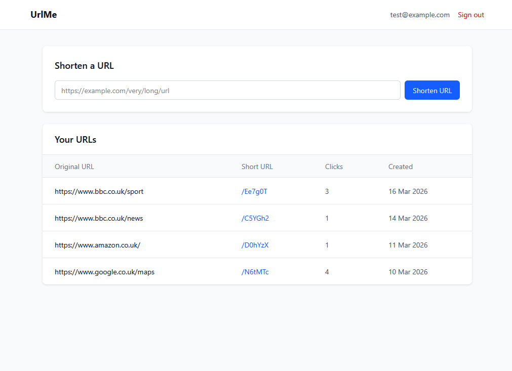

# UrlMe
A full-stack URL shortening application with click tracking, JWT authentication, and a clean dashboard UI.

**Live demo:** [https://urlme-gilt.vercel.app](https://urlme-gilt.vercel.app)



## Overview
UrlMe allows authenticated users to shorten long URLs, manage their shortened links, and track click counts. Built as a hobby project demonstrating production-grade full-stack development practices.

## Tech Stack
| Layer            | Technology                                    |
| ---------------- | --------------------------------------------- |
| Frontend         | Vue 3, TypeScript, Vite, Tailwind CSS         |
| Backend          | Python, Flask, SQLAlchemy, Flask-JWT-Extended |
| Database         | PostgreSQL (Neon)                             |
| Frontend hosting | Vercel                                        |
| Backend hosting  | Render                                        |
| CI/CD            | Github Actions                                |

## Monorepo Structure
```
url-shortener/
├── flask-url/          # Flask REST API
├── vue-url/            # Vue 3 frontend
├── assets/             # Repository assets (screenshots etc)
└── .github/workflows/  # CI/CD pipelines
```
## Documentation
- [Backend - Flask API](./flask-url/README.md)
- [Frontend - Vue 3](./vue-url/README.md)

## CI/CD
Two GitHub Actions workflows run on pull requests targeting `main`:
- `Run Tests` - runs the Flask pytest suite against a real PostgreSQL instance
- `Run Vue Tests` - runs the Vitest component test suite

Both checks must pass before a pull request can be merged. Direct commits to `main` are blocked via branch protection rules.
